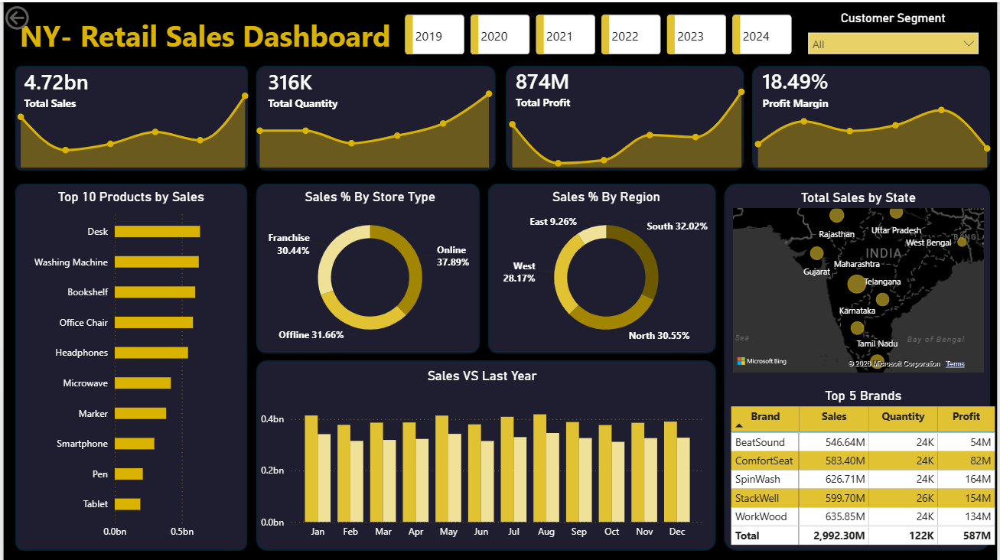

# 📊 NY Retail Sales Dashboard

## Project Overview
This project is an interactive Power BI dashboard built to analyze retail sales performance from 2019 to 2024. It helps businesses monitor sales trends, profitability, customer segments, and regional performance.
---
## Dashboard Preview

---
## Objectives
- Analyze overall sales and profit performance
- Compare current sales with previous year trends
- Identify top-performing products and brands
- Evaluate sales contribution by store type
- Understand regional and state-level performance
---
## Tools & Technologies Used
- Power BI
- Power Query
- DAX
- Microsoft Excel
- CSV Files
- Data visualization
---
## Dataset Information
This project uses four source files:
- `Store.xlsx`
- `Customers.xlsx`
- `Sales.csv`
- `Product.csv`
These files are stored in the **Dataset** folder.
---
## Key Performance Indicators (KPIs)
| KPI | Value |
|-----|------|
| Total Sales | 4.72 Billion |
| Total Quantity | 316K |
| Total Profit | 874 Million |
| Profit Margin | 18.49% |
---
## Dashboard Features
- Year-wise filtering (2019–2024)
- Customer Segment Filter
- Top 10 Products by Sales
- Sales Distribution by Store Type
- Sales Distribution by Region
- State-wise Sales Map
- Monthly Sales vs Last Year Comparison
- Top 5 Brands Analysis
---
## Key Insights
- Online stores contribute the highest share of sales.
- The South region generates the largest percentage of revenue.
- Some brands produce higher profits despite similar sales volumes.
- Monthly sales remain stable with noticeable peaks during certain periods.
---
## How to Use
1. Download or clone this repository.
2. Open `NY_Retail_Sales_Dashboard.pbix` in Power BI Desktop.
3. If prompted, update the file paths in Power Query.
4. Refresh the data.
5. Explore the interactive dashboard.
---
## Author

**Nishi Kumari Yadav**

